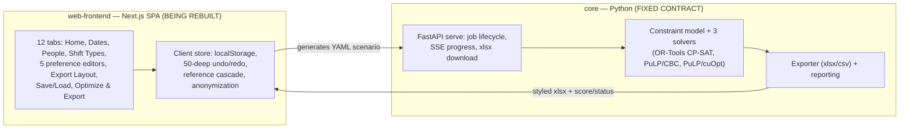

# Epic Brief — Nurse Scheduling Frontend Rebuild

## Summary

Rebuild the **frontend** of the Nurse Scheduling System from scratch with a
completely new interface design, while retaining **100% of the current app's
features and functionality**. The existing Python optimization core (its YAML
scenario schema and HTTP API) is treated as a **fixed external contract** and is
**not** being rebuilt.

This initiative produces a **complete, UI-agnostic functional requirements
specification** of the current app. That spec serves three downstream purposes:

1. **Design input** — hand to Claude Design to design a brand-new interface from
   scratch, without losing any capability.
2. **Rebuild contract** — build a new frontend (different look, same
   capabilities) that can do everything the current one can.
3. **Test basis** — derive test suites from current behavior and use them to
   verify the new app achieves parity.

Sequence: draft & review specs here → hand specs to Claude Design → designs come
back → build the new app against these specs. **Tech stack is deliberately
deferred** — this phase is about *what* the app does, not *how* it is built or
what it looks like.

## Context & Problem

The Nurse Scheduling System automates the nurse/employee scheduling problem
(an operations-research constrained-optimization problem) via a flexible,
hand-editable modeling framework. It is domain-expert-verified and has been used
in real multi-ward scenarios of ~100 nurses. Its stated weakness is a **steep
learning curve** and rough UX — which is the motivation for a fresh interface.

The current system is two parts joined by a YAML contract:

The risk this brief guards against: a redesign that silently drops a
capability, a validation rule, a data-integrity behavior, or a piece of the YAML
contract. Strict parity + a behavior-derived test suite is how we prevent that.

## Affected Users & Systems

- **Head nurses / schedulers** — the primary users who model wards and generate
  schedules. The redesign targets their steep learning curve.
- **Non-developer assistants** — fill data into pre-built ward templates.
- **Claude Design** — downstream consumer of these specs; must be able to
  redesign the UI without a capability inventory gap.
- **The new frontend (to be built)** — must honor the fixed YAML schema + HTTP
  API exactly, and reproduce current behavior.
- **The existing Python core** — unchanged; its schema/API/semantics are
  documented here as *contracts to conform to*, not requirements to re-decide.

## Settled Decisions (this phase)

| Decision | Choice | Implication |
|---|---|---|
| **Rebuild scope** | Frontend-only; Python core is fixed | YAML schema + HTTP API documented as external contracts; functional requirements focus on the frontend/UX. |
| **Fidelity** | **Strict behavioral parity** | Every observable behavior — including quirks (weight decimals truncated via `parseInt`, `copy 2` labels, exact validation-message wording, `OFF`-in-history leaving positional empty slots) and exact error text — is a hard requirement. |
| **Operational / telemetry** | **Excluded for now** | Out of scope this phase: Sentry error reporting + feedback widget, Google Analytics, build-origin selector, cross-tab-sync banner, GitHub version-check banner. **In scope**: privacy/anonymization (part of Save/Load + Optimize), and YAML-load `appVersion` mismatch handling (part of the load flow). |
| **Test suite** | UI-agnostic behavior specs + reuse core tests | Testable given/when/then acceptance criteria per requirement + a consolidated behavior catalog; the UI-independent Python core tests port directly; current UI e2e is re-authored against the new design later. Actual suites are built as a step *after* the spec. |
| **Tech stack** | Deferred | Added after designs return, as technical requirements. |

## Scope — Functional Domains to Specify

High-level inventory only (each becomes its own detailed spec artifact next):

| # | Domain | Essence |
|---|---|---|
| 1 | **Data model & entities** | People, Shift Types, Dates (+ groups); auto-generated reserved entities (`ALL`, `OFF`, weekday groups); IDs-as-labels; history. |
| 2 | **Dates & calendar** | Range-driven date generation; `DD` / `MM-DD` / `YYYY-MM-DD` ID formatting by span; Taiwan-holiday import; date groups. |
| 3 | **People & Shift Types editors** | Item/group CRUD, inline edit, reorder, duplicate, bulk people upload, reserved-keyword rules. |
| 4 | **Preference editors (×5)** | Shift Requests (matrix + quick-add + CSV), Shift Type Requirements, Shift Type Successions, Shift Counts, Shift Affinities — fields, validation, weight semantics. |
| 5 | **Reference integrity** | Rename/delete cascade across preferences, people history, export layout; empty-preference pruning. |
| 6 | **State, history & persistence** | Single store, localStorage, 50-deep undo/redo boundaries, dirty/tab-switch guard. |
| 7 | **Save / Load & YAML** | Full-state replace, download/upload/copy/edit, import warnings, anonymize panel, exact YAML output schema. |
| 8 | **Export Layout** | Formatting rules, extra columns/rows, coefficients, default generated layout. |
| 9 | **Optimize & Export** | Backend selection/health, job submission, SSE progress + chart, cancel/finish-now, heartbeat, xlsx download + ID restore. |
| C | **Fixed contracts (reference)** | YAML scenario schema; HTTP serve API; solver/preference semantics; exporter output — documented as conformance targets, not rebuilt. |
| T | **Behavior / test catalog** | Consolidated UI-agnostic acceptance criteria seeding the parity test suite. |

## Out of Scope

- Rebuilding, modifying, or re-specifying the Python optimization core, solvers,
  or constraint math (documented only as a fixed contract).
- Interface/visual design (Claude Design owns this next).
- Tech-stack and technical architecture of the new frontend (deferred).
- Telemetry, analytics, error reporting, and deployment/build tooling
  (excluded this phase per decision above).

## Proposed Next Step

Build the detailed functional requirements as a **spec story** — one sub-artifact
per domain above, plus the fixed-contract references and the behavior/test
catalog — each written UI-agnostically at strict-parity fidelity with embedded
acceptance criteria.
