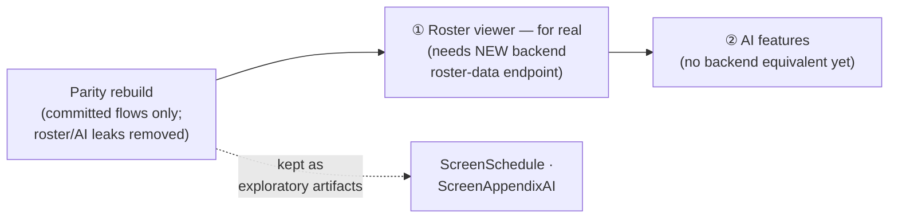

# DL10 — Design-Review Product Decisions

Settled resolutions for the three open product decisions surfaced by the
[design parity + feasibility review](../../../design-parity-feasibility-review/index.md)
(findings 12–15). Decided with the user on 2026-07-15. These are firm; they close
the corresponding review findings and govern the parity build.

## D1 — Person seniority/role field: REJECTED (use groups + coverings)

**Decision.** The prototype's invented per-person **Senior / Junior / Preceptee**
role attribute (`ScreenStaff` 278-282, 357-361) is **not** carried into the build.
No backend/schema change.

**Why.** The backend `Item` is `{id, description, history?, isAutoGenerated?}`
(FR-DM-04) — there is no seniority field, and adding one would break the fixed
backend contract (DL06). Seniority already has two homes:

- **Shift-type qualification** — the seeded model encodes seniority in shift-type
variants (FR-DM-16: `D+` = "Day (Senior Only)", `A-` = "Admin (Assistant Only)")
plus each requirement's `qualifiedPeople` selector.
- **People groups** — a user "Seniors"/"Juniors" group referenced by
`qualifiedPeople`.
- **Preceptorship** — expressed via **shift-type coverings** (the design's own
Staff intro already says "Preceptor supervision lives in Shift type coverings").

**Build note.** Drop the role badge/field. Do not add `Person.seniority`. Spec 01
needs no change (it correctly has no such field).

## D2 — Save/Load anonymize "Remove descriptions" toggle: REJECTED (3-toggle contract stands)

**Decision.** The prototype's **4th anonymize toggle** ("Remove free-text
descriptions", default **ON** — `ScreenSaveLoad` 298-303) is **not** adopted. The
build uses the **three-toggle** Save/Load anonymize panel with descriptions
**preserved**.

**Why.** Spec 08 already defines this and the spec wins (DL06):

- **FR-SL-33** — exactly three toggles: `Replace people item IDs` (ON),
`Replace people group IDs` (OFF), `Scatter shift requests` (OFF).
- **FR-SL-36** — `removeDescriptions` exists in the shared transform but is
**not set by the Save/Load panel**; the panel copy states verbatim *"Free-text*
*descriptions are not changed."*

The two anonymize paths are intentionally distinct: the Optimize path (data
leaving to a possibly third-party solver) may strip more; the Save/Load path
(the user's own YAML, under their control) preserves descriptions as useful
context. The design's default-ON removal silently drops user data — the footgun
the split avoids.

**Build note.** No spec change. Do not port the 4th toggle. The design's inline
"C2 FIX (FR-OE-35)" comment is a misattribution — FR-OE-35 governs the Optimize
screen, not Save/Load.

## D3 — Roster viewer + AI in committed flows: remove now; exploratory-only; roster-first roadmap

**Decision (two parts).**

**a) Parity build — remove the leaks from committed flows.**

- Drop the **"Open & adjust roster"** CTA from the Optimize success panel
(`ScreenGenerate` 92, 100) and the **AI "Planned" teaser** from the infeasible
panel (`ScreenGenerate` 121-127). The committed Optimize outcome is **download**
**XLSX + score/status only** (spec 10; handover §5/§10).
- Keep the roster viewer (`ScreenSchedule`) and AI appendix (`ScreenAppendixAI`)
as **separate exploratory-only design artifacts** — retained, but not wired into
any committed flow.

**b) Post-parity roadmap (settled sequencing).**
After the parity rebuild ships, these become future initiatives, built in this
order:

1. **In-app roster viewer — for real (higher priority).**
2. **AI features (second).**

**Why / constraints.** Both are **beyond parity** and need new backend work the
current contract does not provide:

- The roster viewer requires a **new backend endpoint that returns roster data**
— today the backend returns only the opaque XLSX blob + score/status (C2). This
must be designed as a new contract before the in-app roster can be built for
real.
- AI assist has **no backend equivalent** and is out of the parity inventory
(handover §10).

These are tracked **separately from the parity rebuild** — the parity build must
not depend on either.

## Cross-references

- Review findings resolved: **#12** (role field), **#13** (anonymize toggle),
**#14** (roster CTA), **#15** (AI teaser) —

[design parity + feasibility review](../../../design-parity-feasibility-review/index.md).

- Governing frame: [DL06 — rebaseline to shipped backend](../06-rebaseline-to-shipped-backend/index.md).
- Anchors verified: FR-DM-04 / FR-DM-16 (spec 01); FR-SL-33 / FR-SL-36 (spec 08);
handover §5, §10.
